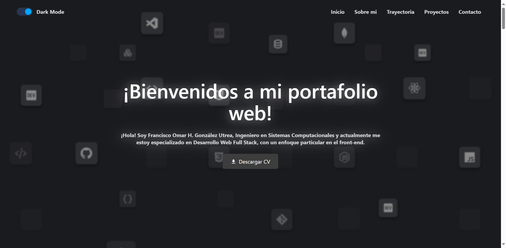

# Mi Portafolio Web

## Descripción

Este es mi portafolio web personal desarrollado con React. Aquí podrás encontrar información sobre mí, mis habilidades, proyectos, y cómo contactarme.

[Visita mi portafolio web](https://frank345-sys.github.io/portfolio_web/)

## Demostración

## Características

- Sección de inicio con una breve introducción.
- Información sobre mis habilidades y experiencia.
- Listado de proyectos con enlaces a detalles de las webs desplegadas y acceso a sus repositorios.
- Diseño responsivo y moderno.
- Tema claro/oscuro.

## Tecnologías Utilizadas

- [React](https://react.dev/) - Biblioteca de JavaScript para construir interfaces de usuario.
- [Styled Components](https://styled-components.com/) - Librería para escribir CSS en JavaScript.
- [Boxicons](https://boxicons.com/usage) - Conjunto de iconos de código abierto cuidadosamente diseñado con más de 1500 iconos, para enriquecer la experiencia del sitio web.
- [react-awesome-revea](https://github.com/morellodev/react-awesome-reveal) react-awesome-reveal - Biblioteca para animaciones de scroll para react.

## Proyectos que utilice para inspirarme

[Enlace 1: Personal Website v2.brittanychiang](https://v2.brittanychiang.com/) - Me sirvio para hacer la sección Trayectoria y Proyectos

Creditos: [Brittany Chiang](https://github.com/bchiang7)

[Enlace 2: coderwars](https://www.codewars.com/) - Me sirvio para hacer el fondo animado de la sección Main

## Autor

Francisco Omar Habib González Utrera 2024
